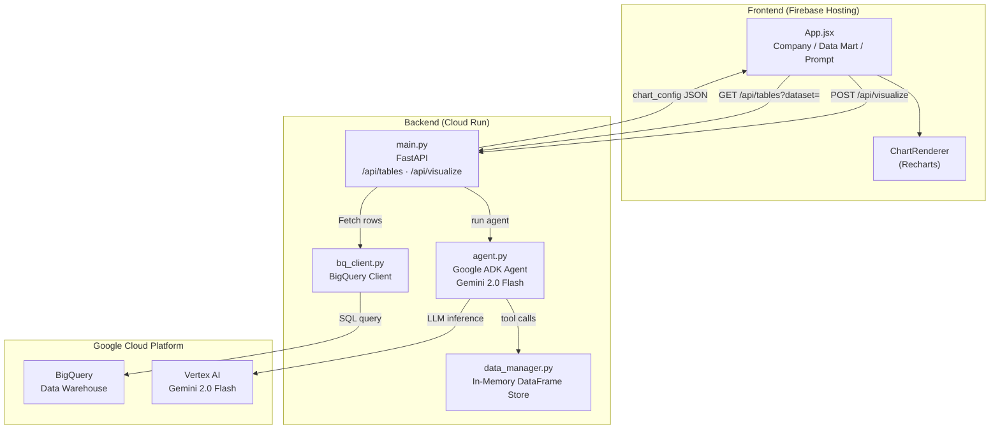

# Prompt-to-Visualization

<div class="project-hero viz-hero">
  <div class="project-hero-content">
    <div class="project-hero-badge">GCP · Gen AI · BigQuery · FastAPI · React</div>
    <h1>📊 Prompt-to-Visualization</h1>
    <p class="project-tagline">Ask a question about your data in plain English. Get an interactive chart with AI-generated insights — no SQL required.</p>
    <div class="project-links">
      <a href="https://github.com/Aditya1614/Prompt-to-Visualization" target="_blank" class="btn-primary">View on GitHub ↗</a>
    </div>
  </div>
</div>

---

## Overview

**Prompt-to-Visualization** is an internal analytics tool that lets business users generate interactive data visualizations from BigQuery data warehouses using natural language. Select a company dataset and table, type a question like *"Show me the city with the most customers"*, and the AI produces a chart with insights — no SQL knowledge needed.

> Deployed on **Google Cloud Run** (backend) + **Firebase Hosting** (frontend), connected to **BigQuery** via **Vertex AI** (Gemini 2.0 Flash).

---

## GCP Architecture



---

## How It Works

<div class="card-grid">
  <div class="feature-card">
    <span class="card-icon">1️⃣</span>
    <h3>Select Data Source</h3>
    <p>User selects a BigQuery dataset (company) and a data mart table from the dropdown list fetched via <code>GET /api/tables</code>.</p>
  </div>
  <div class="feature-card">
    <span class="card-icon">2️⃣</span>
    <h3>Type a Question</h3>
    <p>User types a natural language question like <em>"What are the top 5 products by revenue this month?"</em></p>
  </div>
  <div class="feature-card">
    <span class="card-icon">3️⃣</span>
    <h3>AI Agent Processes</h3>
    <p>The Google ADK Agent (Gemini 2.0 Flash) inspects the schema, writes a pandas query, aggregates the data, and builds a chart configuration JSON.</p>
  </div>
  <div class="feature-card">
    <span class="card-icon">4️⃣</span>
    <h3>Chart + Insight</h3>
    <p>React renders the chart via Recharts. The AI also generates a natural-language insight summarizing the key finding.</p>
  </div>
</div>

---

## AI Agent Deep-Dive

The agent uses the **Google Agent Development Kit (ADK)** with **Gemini 2.0 Flash** as the LLM backbone. It autonomously follows a 3-step reasoning loop:

```
Step 1 (Inspect)  → get_data_schema("bq_table")
                      Returns: columns, dtypes, row_count, sample_rows

Step 2 (Query)    → query_data("bq_table", "df.groupby('city')['id'].count()...")
                      Returns: Aggregated result as list of dicts

Step 3 (Respond)  → Returns structured JSON:
                      { chart_type, chart_config, insight }
```

!!! note "Agent Constraints"
    The agent is constrained to **read-only pandas operations** on pre-fetched data — no direct SQL is generated against BigQuery at query time. This ensures safety and predictable token usage.

---

## End-to-End Flow

```
User → Select Dataset & Table
     → FastAPI fetches ALL rows from BigQuery (up to 10,000)
     → Rows stored in-memory DataManager
     → User types prompt → POST /api/visualize
     → ADK Agent runs: inspect schema → query/aggregate → build JSON
     → FastAPI returns VisualizeResponse + token_usage
     → React renders Recharts chart + AI insight + token stats
```

---

## Tech Stack

| Layer | Technology |
|---|---|
| AI Agent | Google ADK + Gemini 2.0 Flash (Vertex AI) |
| Backend | FastAPI (Python) |
| Frontend | React + Recharts |
| Data Warehouse | BigQuery |
| Backend Hosting | Google Cloud Run |
| Frontend Hosting | Firebase Hosting |
| Integration | Google BigQuery Python Client |

---

## API Endpoints

| Method | Endpoint | Description |
|---|---|---|
| `GET` | `/api/tables?dataset={name}` | List available tables in a BigQuery dataset |
| `POST` | `/api/visualize` | Generate chart from natural language prompt |

**POST `/api/visualize` request:**
```json
{
  "prompt": "Show me the city with the most customers",
  "table_name": "customer_data",
  "dataset": "pis"
}
```

**Response:**
```json
{
  "chart_type": "bar",
  "chart_config": { ... },
  "insight": "Jakarta has the highest customer count with 12,340 customers, representing 34% of total.",
  "token_usage": { "input": 1204, "output": 387 }
}
```

---

!!! success "Production Deployment"
    Deployed and actively used at **PT Porto Indonesia Sejahtera**. Backend running on **Cloud Run**, frontend on **Firebase Hosting**, with live data from the **BigQuery** data warehouse built with the CDC pipeline.
